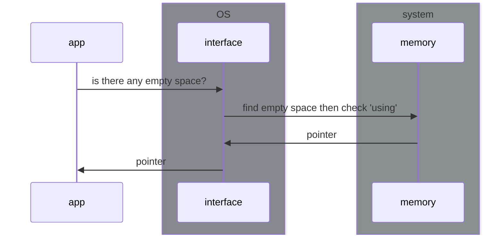

# stack
- FILO
- push, pop
- strict size.
  - dynamic sized value should on Heap.
- assigning is faster than using Heap.

# heap

- pointer has strict size
  - able to store 'STACK'
  - but value, still in heap.

# calling function
- args, local values are pushed into stack.
- popped at end of function.

# owner
- rust owner related mainly Heap.
- tracking which data are used on heap, minimize duplicate on heap, organize heap

## default rule
- each value has owner
- each value has one owner, default.
- owner is dropped when end of scope. 